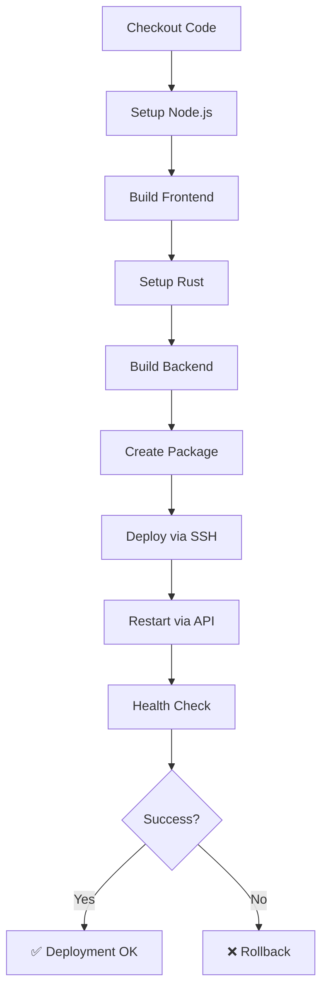

# 🚀 CI/CD & Déploiement - Guide complet

Ce dossier contient toute la configuration pour le déploiement automatique sur AlwaysData via GitHub Actions.

## 📁 Fichiers

| Fichier | Description |
|---------|-------------|
| `workflows/deploy.yml` | Workflow GitHub Actions principal |
| `DEPLOYMENT_SETUP.md` | Configuration des secrets GitHub |
| `ALWAYSDATA_SETUP.md` | Configuration complète d'AlwaysData |
| `CI_CD_SUMMARY.md` | Résumé rapide du CI/CD |

## 🚀 Démarrage rapide

### 1. Configuration AlwaysData (15 min)

Suivez **`ALWAYSDATA_SETUP.md`** :

```bash
# Sur AlwaysData
1. Créer la base MySQL
2. Créer le site/application custom
3. Générer le token API
4. Ajouter votre clé SSH publique
5. Créer le dossier ~/voxicraft-auth-backend
6. Configurer le .env sur le serveur
```

### 2. Configuration GitHub (5 min)

Suivez **`DEPLOYMENT_SETUP.md`** :

```bash
# Sur GitHub
Settings → Secrets → Actions → New repository secret

Ajouter ces 8 secrets :
- ALWAYSDATA_SSH_KEY
- ALWAYSDATA_HOST
- ALWAYSDATA_USER
- ALWAYSDATA_DEPLOY_PATH
- ALWAYSDATA_API_KEY
- ALWAYSDATA_ACCOUNT
- ALWAYSDATA_SITE_ID
- APP_URL
```

### 3. Premier déploiement (2 min)

```bash
# Sur votre machine locale
git add .
git commit -m "ci: configure GitHub Actions deployment"
git push origin main

# → Le workflow se déclenche automatiquement !
```

Surveillez le déploiement : **GitHub → Actions**

## 🎯 Workflow

### Déclenchement automatique

Le workflow se déclenche sur :
- ✅ Push sur `main`
- ✅ Push sur `production`

### Déclenchement manuel

1. GitHub → **Actions**
2. **Build and Deploy to AlwaysData**
3. **Run workflow** → Sélectionnez la branche → **Run**

### Rollback

En cas de problème :

1. GitHub → **Actions** → Dernier workflow réussi
2. **Re-run jobs**

Ou rollback manuel via le job séparé.

## 📊 Étapes du workflow



### Temps estimés

- Frontend build: ~2 min
- Backend build: ~3-8 min (selon cache)
- Déploiement: ~1 min
- **Total: ~6-12 min**

## 🔐 Sécurité

### Secrets GitHub

- Tous les secrets sont chiffrés par GitHub
- Jamais affichés dans les logs
- Accessibles uniquement par les workflows

### SSH

- Utilise une clé SSH dédiée
- Pas de mot de passe stocké
- Connexion sécurisée

### API AlwaysData

- Token révocable à tout moment
- Permissions limitées aux opérations nécessaires

## 🐛 Dépannage

### Le workflow échoue

1. **Build frontend fails** → Vérifier `package.json` et dépendances
2. **Build backend fails** → Vérifier `Cargo.toml` et compilation locale
3. **SSH fails** → Vérifier le secret `ALWAYSDATA_SSH_KEY`
4. **API restart fails** → Vérifier `ALWAYSDATA_API_KEY` et `SITE_ID`
5. **Health check fails** → Vérifier que l'app démarre (logs AlwaysData)

### Logs détaillés

Cliquez sur l'étape qui échoue dans GitHub Actions pour voir les logs complets.

### Tester localement

```bash
# Test build frontend
cd frontend && npm run build

# Test build backend
cd backend && cargo build --release

# Test connexion SSH
ssh <user>@<host>

# Test API AlwaysData
curl -u "<account>:<token>" https://api.alwaysdata.com/v1/site/<id>/
```

## 📚 Documentation complète

| Besoin | Fichier à consulter |
|--------|---------------------|
| **Premiers pas** | Ce README |
| **Configurer GitHub** | `DEPLOYMENT_SETUP.md` |
| **Configurer AlwaysData** | `ALWAYSDATA_SETUP.md` |
| **Comprendre le workflow** | `CI_CD_SUMMARY.md` |
| **Modifier le workflow** | `workflows/deploy.yml` |

## 🎓 Bonnes pratiques

### Avant de pousser

```bash
# Toujours tester localement
npm run build           # Frontend
cargo build --release   # Backend
cargo test              # Tests
```

### Branches

- `main` → Déploiement automatique
- `production` → Déploiement automatique
- Autres branches → Pas de déploiement automatique

### Commits

Utilisez des messages clairs :

```bash
git commit -m "feat: nouvelle fonctionnalité"
git commit -m "fix: correction bug auth"
git commit -m "docs: mise à jour README"
git commit -m "ci: amélioration workflow"
```

### Variables d'environnement

- **Développement** : `.env` local
- **Production** : `.env` sur le serveur AlwaysData
- **Ne jamais commit** de fichiers `.env` avec des secrets

## 🔄 Workflow de développement

```bash
# 1. Développement local
git checkout -b feature/nouvelle-fonctionnalite
# ... développement ...
npm run dev     # Frontend
cargo run       # Backend

# 2. Tests
npm test
cargo test

# 3. Commit et push
git add .
git commit -m "feat: nouvelle fonctionnalité"
git push origin feature/nouvelle-fonctionnalite

# 4. Pull Request sur GitHub
# ... revue de code ...

# 5. Merge dans main
# → Déploiement automatique !
```

## 📈 Monitoring

### Vérifier le déploiement

1. GitHub Actions : État du workflow
2. AlwaysData Admin : État du site
3. Application URL : Test de l'app

### Logs

```bash
# Via SSH
ssh <user>@<host>
cd ~/voxicraft-auth-backend
tail -f logs/app.log

# Via AlwaysData
Web → Sites → Votre site → Logs
```

## 🆘 Support

### Documentation

- [GitHub Actions](https://docs.github.com/en/actions)
- [AlwaysData](https://help.alwaysdata.com/)
- [Rust Deployment](https://doc.rust-lang.org/cargo/)

### Problème ?

1. Vérifier les logs GitHub Actions
2. Vérifier les logs AlwaysData
3. Tester la connexion SSH
4. Vérifier l'état de l'API

## ✅ Checklist complète

### Configuration initiale

- [ ] Base MySQL créée sur AlwaysData
- [ ] Site custom configuré sur AlwaysData
- [ ] Token API généré
- [ ] Clé SSH générée et ajoutée
- [ ] Dossier de déploiement créé
- [ ] `.env` configuré sur le serveur
- [ ] 8 secrets GitHub configurés
- [ ] Workflow testé avec succès

### À chaque déploiement

- [ ] Tests locaux passent
- [ ] Build local réussit
- [ ] Commit avec message clair
- [ ] Push sur `main`
- [ ] Workflow GitHub réussit
- [ ] Health check passe
- [ ] Application accessible

---

## 🎉 Félicitations !

Votre CI/CD est **complètement configurée** ! Chaque push sur `main` déploiera automatiquement votre application sur AlwaysData.

**Happy deploying! 🚀**
