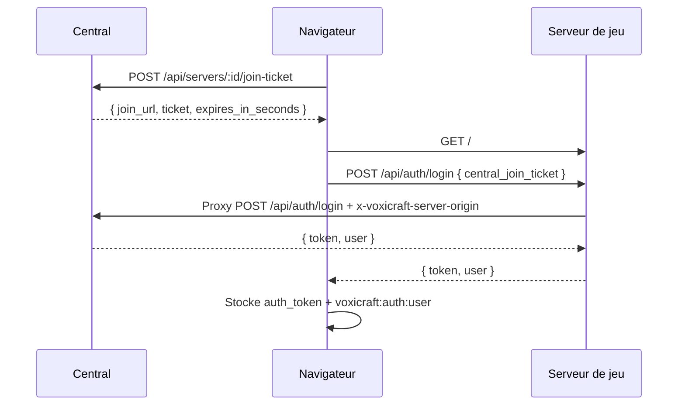

# Central Join Ticket

Le protocole **Central Join Ticket** permet à un utilisateur déjà connecté sur le central de rejoindre un ami sur un serveur de jeu sans ressaisir son email et son mot de passe.

## Objectif

Quand un utilisateur clique sur **Rejoindre** depuis la liste d'amis du central :

1. le central crée un ticket temporaire lié au serveur de jeu ciblé ;
2. le navigateur ouvre le serveur de jeu avec ce ticket dans le fragment d'URL ;
3. le serveur de jeu consomme ce ticket via son proxy d'authentification existant ;
4. le central valide le ticket et retourne une session classique `{ token, user }` ;
5. le serveur de jeu considère l'utilisateur comme connecté sans afficher le formulaire de login.

## Flux complet



## Route de création du ticket

```http
POST /api/servers/:id/join-ticket
Authorization: Bearer <central_jwt>
```

Réponse :

```json
{
  "ticket": "opaque-random-token",
  "join_url": "https://game.example/#central_join_ticket=opaque-random-token",
  "expires_in_seconds": 60
}
```

Le ticket est placé dans le fragment `#central_join_ticket=...` afin d'éviter qu'il apparaisse automatiquement dans les logs HTTP du serveur de jeu.

## Login via ticket

Le serveur de jeu utilise son endpoint existant :

```http
POST /api/auth/login
Content-Type: application/json
```

Body :

```json
{
  "central_join_ticket": "opaque-random-token"
}
```

Le proxy du serveur de jeu transmet la requête au central et ajoute le header :

```http
x-voxicraft-server-origin: https://game.example
```

Le central vérifie que le ticket correspond bien à ce domaine.

## Garanties de sécurité

Le ticket est :

- court : expiration en 60 secondes ;
- à usage unique ;
- lié à un serveur de jeu précis ;
- inutilisable si le domaine transmis par `x-voxicraft-server-origin` ne correspond pas ;
- échangé contre une session normale uniquement par le central.

Les utilisateurs qui arrivent directement sur le serveur de jeu sans ticket continuent d'utiliser le login classique email / mot de passe.

## Variables d'environnement

Aucune variable supplémentaire n'est requise pour le flux proxy `/api/auth/login`.

La variable `CENTRAL_JOIN_TICKET_SECRET` reste utile uniquement pour la route serveur-à-serveur historique :

```http
POST /api/auth/join-ticket/verify
```

Cette route peut être utilisée pour des intégrations backend strictes, mais le flux recommandé pour le serveur de jeu Voxicraft est le proxy `/api/auth/login` avec `central_join_ticket`.
